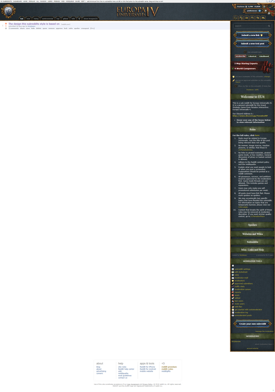

# /r/EU4 styles

These styles were created for the EU4 subreddit - I have no official affiliation with the subreddit other than stumbling upon posts from it on /r/all.

## Development

Clone the repo, make sure you have Node installed, run `npm start`, edit `secrets.json`, run `npm start` again. Any time you change any CSS it will now be uploaded to your subreddit of choice automatically.

In order for images to work you must manually upload the images in `resources` to the subreddit (under Moderator tools > Edit subreddit style) - the images in `resources/unused` can be ignored.

